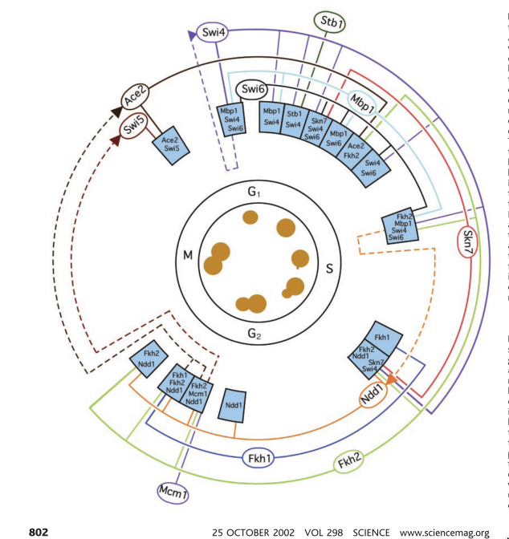
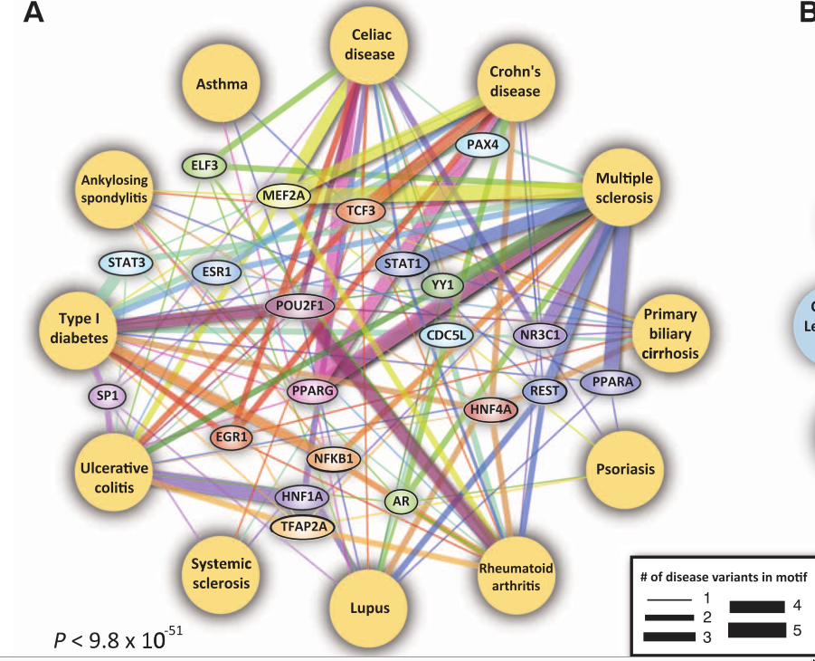
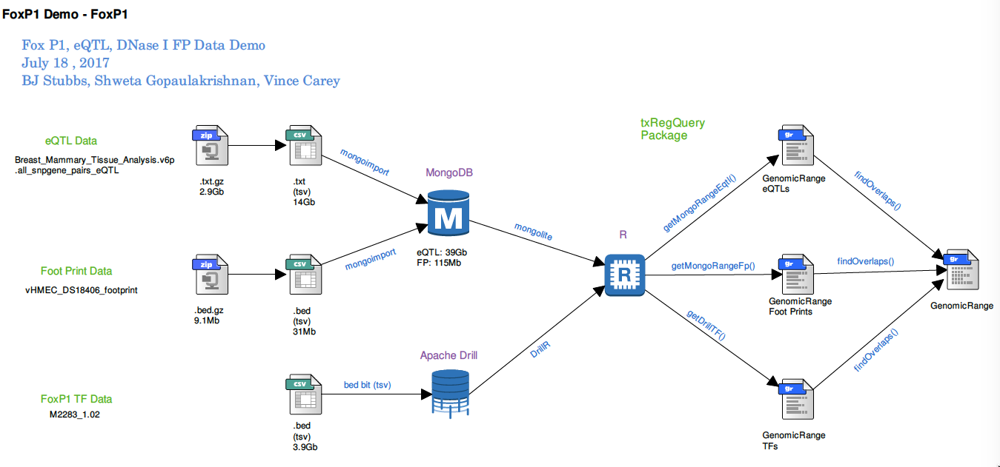

## Lee, Rinaldi et al. _Science_ 2002: TxRegNet for _S. cerevisiae_

- Condition/phenotype: stage $G_1, S, G_2, M$, budding

- Blue boxes: upregulated genes

- Ovals/Arcs: transcription factors and their periods of influence

## Maurano, Humbert et al. _Science_ 2012: "Common (human) disease network"

- Disease:DNA -- GWAS SNPs in FIMO-identified binding sites

- Sequence for motif finding: hg19-alt -- all SNP sites coded as alternate allele
, with GWAS SNPs that disrupt FIMO-identified binding sites (BSgenome has a method for SNP-injection)
 
- *New challenge*: from sequence-derived TFBS, epigenomically defined regulatory regions (tissue-specific), tissue-specific (GTEX) eQTL, derive regulatory networks to help interpret local COPD GWAS

##

